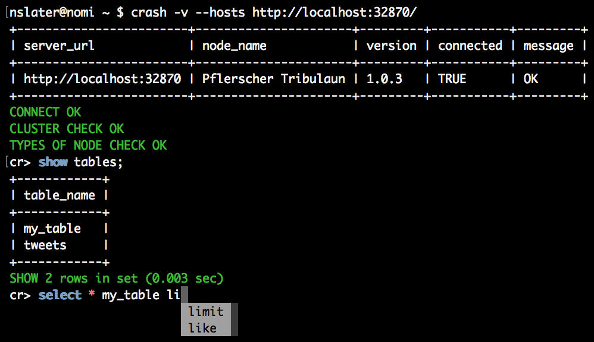

=====
Crash
=====

.. image:: https://travis-ci.org/crate/crash.svg?branch=master
    :target: https://travis-ci.org/crate/crash
    :alt: Travis CI

.. image:: https://badge.fury.io/py/crash.png
    :target: http://badge.fury.io/py/crash
    :alt: Version

.. image:: https://img.shields.io/badge/docs-latest-brightgreen.svg
    :target: https://crate.io/docs/reference/crash/
    :alt: Documentation

.. image:: https://img.shields.io/pypi/pyversions/crash.svg
    :target: https://pypi.python.org/pypi/crash/
    :alt: Python Version

.. image:: https://img.shields.io/coveralls/crate/crash.svg
    :target: https://coveralls.io/r/crate/crash?branch=master
    :alt: Coverage

|

Crash is an interactive CrateDB *command line interface* (CLI) SQL shell with autocompletion.

Screenshot
==========

Prerequisites
=============

Recent versions of Crash require **Python 3** (>= 3.4) to run.

Use Crash version ``0.23.x`` if you are running Python 2.7/3.3 or version
``0.16.x`` if you're running Python 2.6.

Installation
============

As a Python Package
-------------------

Crash is available as a pip_ package.

To install, run::

    $ pip install crash

Now, run it::

    $ crash

To update, run::

    $ pip install -U crash

If you use Python 2.7 or 3.3 with a recent version of pip_, it will install
only version ``0.23.x`` by default, because newer versions of this package are
not compatible with Python 2.7/3.3 any more.

Standalone
----------

Crash is also available as a standalone executable that includes all the
necessary dependencies, and can be run as long as Python (>= 3.4) is available.

First, download the executable::

    $ curl -o crash https://cdn.crate.io/downloads/releases/crash_standalone_latest

Then, make it executable::

    $ chmod +x crash

Now, run it::

    $ ./crash

If you would like to run ``crash`` from any directory and without using leading
``./`` you will need to move it to somewhere on your ``$PATH``.

Legacy Versions
...............

For Python 2.7 and 3.3 please download version ``0.23.0`` from the CDN::

    $ curl -o crash https://cdn.crate.io/downloads/releases/crash_standalone_0.23.0

For Python 2.6 please download version ``0.16.2`` from the CDN::

    $ curl -o crash https://cdn.crate.io/downloads/releases/crash_standalone_0.16.2

Usage
=====

For usage information and options, run::

    $ crash --help

Contributing
============

This project is primarily maintained by Crate.io_, but we welcome community
contributions!

See the `developer docs`_ and the `contribution docs`_ for more information.

Help
====

Looking for more help?

- Read `the project documentation`_
- Check `StackOverflow`_ for common problems
- Chat with us on `Slack`_
- Get `paid support`_

.. _contribution docs: CONTRIBUTING.rst
.. _Crate.io: http://crate.io/
.. _developer docs: DEVELOP.rst
.. _paid support: https://crate.io/pricing/
.. _pip: https://pypi.python.org/pypi/pip
.. _Slack: https://crate.io/docs/support/slackin/
.. _StackOverflow: https://stackoverflow.com/tags/crate
.. _the project documentation: https://crate.io/docs/reference/crash/
