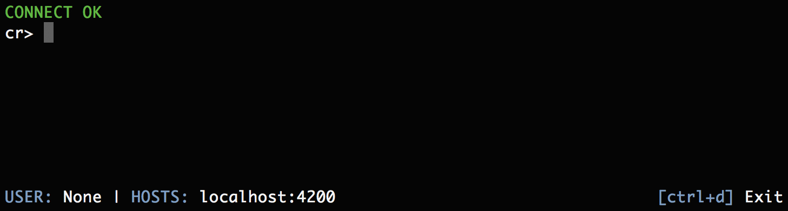
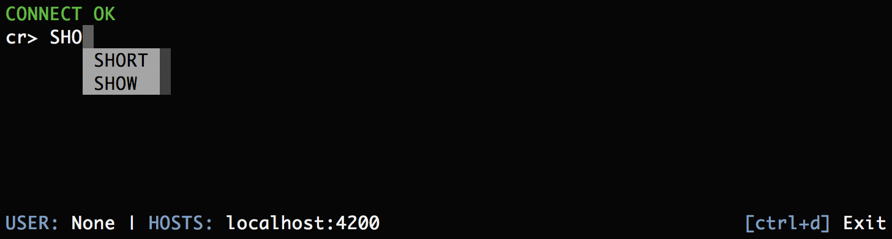
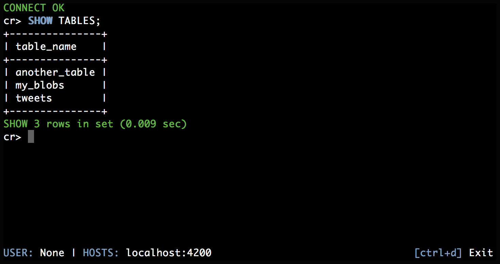

.. _getting-started:

===============
Getting started
===============

.. rubric:: Table of contents

.. contents::
   :local:

Installation
============

.. SEEALSO::

    Consult the :ref:`compatibility` appendix for prerequisites information.

Python package
--------------

Crash is available as a `pip`_ package.

To install, run:

.. code-block:: console

    sh$ pip install crash

Now, run it:

.. code-block:: console

    sh$ crash

To update, run:

.. code-block:: console

    sh$ pip install -U crash

Standalone
----------

Crash is also available as a standalone executable that includes all the
necessary dependencies, and can be run as long as Python (>= 3.4) is available
on your system.

First, download the executable file:

.. code-block:: console

    sh$ curl -o crash https://cdn.crate.io/downloads/releases/crash_standalone_latest

Then, set the executable bit:

.. code-block:: console

    sh$ chmod +x crash

Now, run it:

.. code-block:: console

    sh$ ./crash

If you would like to run ``crash`` from any directory, and without the leading
``./``, the file has to be in a directory that is on your `PATH`_.

Legacy versions
...............

For Python 2.7 and 3.3 please download version 0.23.0 from the CDN:

.. code-block:: console

    sh$ curl -o crash https://cdn.crate.io/downloads/releases/crash_standalone_0.23.0

For Python 2.6 please download version 0.16.2 from the CDN:

.. code-block:: console

    sh$ curl -o crash https://cdn.crate.io/downloads/releases/crash_standalone_0.16.2

Run
===

You can start Crash like so:

.. code-block:: console

  sh$ crash

When ``crash`` is run without any additional arguments, it will attempt to
connect to ``localhost:4200``. To connect to another host, use the ``--hosts``
flag. For example:

.. code-block:: console

  sh$ crash --host "198.51.100.1"

If you are experiencing a connection error, try the ``--verbose`` flag:

.. code-block:: console

  sh$ crash --verbose

When run with ``--verbose``, Crash will print useful information about
what it is doing to `STDOUT`_. This includes connection attempts and full stack
traces (in the case of an error).

.. SEEALSO::

   For more help, see :ref:`run`.

Query
=====

When you run Crash, you will see something like this:

This is an interactive `shell`_. You can type any CrateDB SQL query at the
``cr>`` prompt.

Queries are autocompleted as you type:

Once you have entered your query, terminate it using ``;``,
and hit :kbd:`Enter` to execute it.

You should see something like this:

.. SEEALSO::

   For more help, see :ref:`commands` or :ref:`formats`.

.. _Command Line Arguments: https://cratedb.com/docs/projects/crash/en/stable/cli.html
.. _crate-python: https://pypi.python.org/pypi/crate/
.. _CrateDB REST Endpoint: https://cratedb.com/docs/current/sql/rest.html
.. _CrateDB: https://cratedb.com/products/cratedb/
.. _PATH: https://en.wikipedia.org/wiki/PATH_(variable)
.. _pip: https://pypi.org/project/pip/
.. _PyPI overview: https://pypi.python.org/pypi/crash/
.. _Running CrateDB: https://cratedb.com/docs/crate/reference/en/latest/run.html
.. _shell: https://en.wikipedia.org/wiki/Shell_(computing)
.. _STDOUT: https://en.wikipedia.org/wiki/Standard_streams
