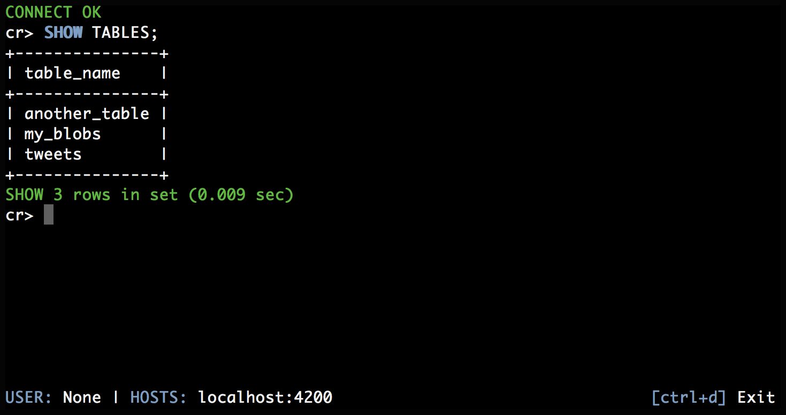

.. _index:

=================
The CrateDB Shell
=================

The CrateDB Shell (aka *Crash*) is an interactive `CLI`_ for working with CrateDB.

.. rubric:: Table of contents

.. toctree::
   :maxdepth: 2

   getting-started
   run
   commands
   troubleshooting
   appendices/index

.. SEEALSO::

   Crash is an open source project and is `hosted on GitHub`_.

.. _CLI: https://en.wikipedia.org/wiki/Command-line_interface
.. _hosted on GitHub: https://github.com/crate/crash
